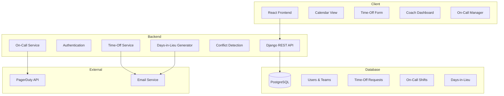
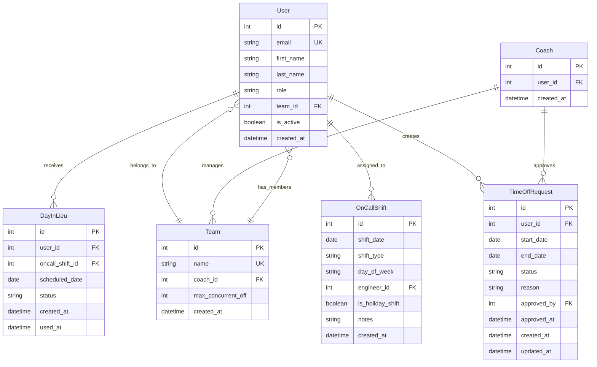
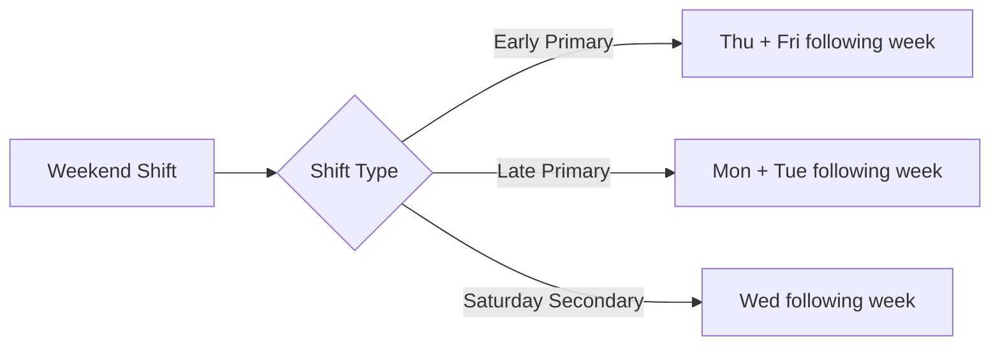
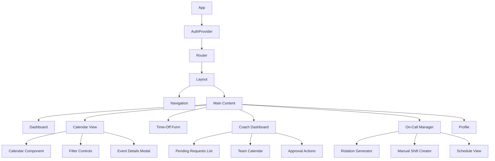
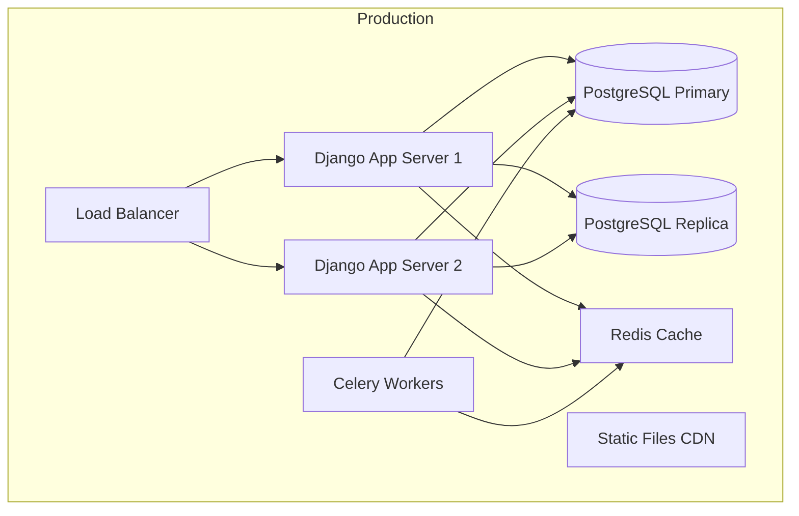

# Calendar Application - Technical Specification

## Project Overview

A comprehensive calendar application for managing team time-off requests and on-call weekend rotations with automatic days-in-lieu compensation.

## Table of Contents

1. [System Architecture](#system-architecture)
2. [Technology Stack](#technology-stack)
3. [Database Schema](#database-schema)
4. [API Endpoints](#api-endpoints)
5. [On-Call Rotation Logic](#on-call-rotation-logic)
6. [Business Rules](#business-rules)
7. [User Roles & Permissions](#user-roles--permissions)
8. [Frontend Components](#frontend-components)
9. [Development Roadmap](#development-roadmap)

---

## System Architecture



---

## Technology Stack

### Backend
- **Framework**: Django 4.2+
- **API**: Django REST Framework 3.14+
- **Database**: PostgreSQL 14+
- **Authentication**: Django Token Authentication / JWT
- **Task Queue**: Celery (for scheduled tasks)
- **Cache**: Redis (optional, for performance)

### Frontend
- **Framework**: React 18+
- **State Management**: Redux Toolkit or Context API
- **Routing**: React Router v6
- **UI Library**: Material-UI or Tailwind CSS
- **Calendar Component**: FullCalendar or React Big Calendar
- **HTTP Client**: Axios
- **Form Handling**: React Hook Form

### Development Tools
- **API Documentation**: Swagger/OpenAPI
- **Testing**: pytest (backend), Jest/React Testing Library (frontend)
- **Code Quality**: ESLint, Prettier, Black, Flake8
- **Version Control**: Git

---

## Database Schema



### Model Definitions

#### User Model
```python
class User(AbstractUser):
    ROLE_CHOICES = [
        ('engineer', 'Engineer'),
        ('coach', 'Coach'),
        ('admin', 'Admin'),
    ]
    role = models.CharField(max_length=20, choices=ROLE_CHOICES, default='engineer')
    team = models.ForeignKey('Team', on_delete=models.SET_NULL, null=True)
    phone_number = models.CharField(max_length=20, blank=True)
```

#### Team Model
```python
class Team(models.Model):
    name = models.CharField(max_length=100, unique=True)
    coach = models.ForeignKey(User, on_delete=models.SET_NULL, null=True, related_name='coached_teams')
    max_concurrent_off = models.IntegerField(default=2)
    created_at = models.DateTimeField(auto_now_add=True)
```

#### TimeOffRequest Model
```python
class TimeOffRequest(models.Model):
    STATUS_CHOICES = [
        ('pending', 'Pending'),
        ('approved', 'Approved'),
        ('rejected', 'Rejected'),
        ('cancelled', 'Cancelled'),
    ]
    user = models.ForeignKey(User, on_delete=models.CASCADE)
    start_date = models.DateField()
    end_date = models.DateField()
    status = models.CharField(max_length=20, choices=STATUS_CHOICES, default='pending')
    reason = models.TextField(blank=True)
    approved_by = models.ForeignKey(User, on_delete=models.SET_NULL, null=True, related_name='approved_requests')
    approved_at = models.DateTimeField(null=True, blank=True)
    created_at = models.DateTimeField(auto_now_add=True)
    updated_at = models.DateTimeField(auto_now=True)
```

#### OnCallShift Model
```python
class OnCallShift(models.Model):
    SHIFT_TYPE_CHOICES = [
        ('early_primary', 'Early Primary'),
        ('late_primary', 'Late Primary'),
        ('secondary', 'Secondary'),
    ]
    DAY_CHOICES = [
        ('saturday', 'Saturday'),
        ('sunday', 'Sunday'),
    ]
    shift_date = models.DateField()
    shift_type = models.CharField(max_length=20, choices=SHIFT_TYPE_CHOICES)
    day_of_week = models.CharField(max_length=10, choices=DAY_CHOICES)
    engineer = models.ForeignKey(User, on_delete=models.CASCADE)
    is_holiday_shift = models.BooleanField(default=False)
    notes = models.TextField(blank=True)
    created_at = models.DateTimeField(auto_now_add=True)
```

#### DayInLieu Model
```python
class DayInLieu(models.Model):
    STATUS_CHOICES = [
        ('scheduled', 'Scheduled'),
        ('used', 'Used'),
        ('expired', 'Expired'),
    ]
    user = models.ForeignKey(User, on_delete=models.CASCADE)
    oncall_shift = models.ForeignKey(OnCallShift, on_delete=models.CASCADE)
    scheduled_date = models.DateField()
    status = models.CharField(max_length=20, choices=STATUS_CHOICES, default='scheduled')
    created_at = models.DateTimeField(auto_now_add=True)
    used_at = models.DateTimeField(null=True, blank=True)
```

---

## API Endpoints

### Authentication
- `POST /api/auth/login/` - User login
- `POST /api/auth/logout/` - User logout
- `GET /api/auth/me/` - Get current user info
- `POST /api/auth/refresh/` - Refresh authentication token

### Users & Teams
- `GET /api/users/` - List all users (admin/coach only)
- `GET /api/users/{id}/` - Get user details
- `GET /api/teams/` - List all teams
- `GET /api/teams/{id}/` - Get team details
- `GET /api/teams/{id}/members/` - Get team members

### Time-Off Requests
- `GET /api/timeoff/` - List time-off requests (filtered by permissions)
- `POST /api/timeoff/` - Create new time-off request
- `GET /api/timeoff/{id}/` - Get time-off request details
- `PATCH /api/timeoff/{id}/` - Update time-off request
- `DELETE /api/timeoff/{id}/` - Cancel time-off request
- `POST /api/timeoff/{id}/approve/` - Approve request (coach only)
- `POST /api/timeoff/{id}/reject/` - Reject request (coach only)
- `GET /api/timeoff/conflicts/` - Check for conflicts

### On-Call Shifts
- `GET /api/oncall/shifts/` - List on-call shifts
- `POST /api/oncall/shifts/` - Create manual shift (admin only)
- `GET /api/oncall/shifts/{id}/` - Get shift details
- `PATCH /api/oncall/shifts/{id}/` - Update shift
- `DELETE /api/oncall/shifts/{id}/` - Delete shift
- `POST /api/oncall/generate-rotation/` - Generate rotation for date range
- `GET /api/oncall/schedule/` - Get on-call schedule (calendar view)

### Days-in-Lieu
- `GET /api/days-in-lieu/` - List days-in-lieu
- `GET /api/days-in-lieu/my/` - Get current user's days-in-lieu
- `POST /api/days-in-lieu/{id}/use/` - Mark day as used
- `GET /api/days-in-lieu/balance/` - Get user's balance

### Calendar
- `GET /api/calendar/events/` - Get all calendar events (time-off + on-call)
- `GET /api/calendar/events/?filter=user` - Filter by user
- `GET /api/calendar/events/?filter=team` - Filter by team
- `GET /api/calendar/events/?filter=organization` - Filter by organization

---

## On-Call Rotation Logic

### Weekend Shift Structure

Each weekend consists of 5 shifts across Saturday and Sunday:

**Saturday:**
1. Early Primary (8am-4pm)
2. Late Primary (4pm-12am)
3. Secondary (8am-12am) - supports both shifts

**Sunday:**
4. Early Primary (8am-4pm) - same engineer as Saturday Early
5. Late Primary (4pm-12am) - same engineer as Saturday Late
   - Late Primary is Secondary for Early shift
   - Early Primary is Secondary for Late shift

### Days-in-Lieu Assignment



**Compensation Schedule:**
- **Early Primary** (Sat + Sun): Thursday & Friday of following week
- **Late Primary** (Sat + Sun): Monday & Tuesday of following week
- **Saturday Secondary**: Wednesday of following week

### Rotation Algorithm

```python
def generate_weekend_rotation(start_date, end_date, engineers):
    """
    Generate on-call rotation for weekends in date range.
    
    Logic:
    1. Get all Saturdays in range
    2. For each weekend:
       - Assign 3 engineers (Early, Late, Secondary)
       - Ensure fair distribution
       - Avoid consecutive weekends for same engineer
       - Check for time-off conflicts
    3. Create OnCallShift records
    4. Generate corresponding DayInLieu records
    """
    weekends = get_saturdays_in_range(start_date, end_date)
    available_engineers = get_available_engineers(engineers)
    
    for saturday in weekends:
        sunday = saturday + timedelta(days=1)
        
        # Select engineers avoiding recent assignments
        early_engineer = select_engineer(available_engineers, 'early', saturday)
        late_engineer = select_engineer(available_engineers, 'late', saturday)
        secondary_engineer = select_engineer(available_engineers, 'secondary', saturday)
        
        # Create Saturday shifts
        create_shift(saturday, 'early_primary', 'saturday', early_engineer)
        create_shift(saturday, 'late_primary', 'saturday', late_engineer)
        create_shift(saturday, 'secondary', 'saturday', secondary_engineer)
        
        # Create Sunday shifts
        create_shift(sunday, 'early_primary', 'sunday', early_engineer)
        create_shift(sunday, 'late_primary', 'sunday', late_engineer)
        
        # Generate days-in-lieu
        generate_days_in_lieu(early_engineer, saturday, 'early')
        generate_days_in_lieu(late_engineer, saturday, 'late')
        generate_days_in_lieu(secondary_engineer, saturday, 'secondary')
```

### Holiday Shift Handling

- Manual creation of shifts for holidays
- Does not participate in automatic rotation
- Still generates days-in-lieu
- Marked with `is_holiday_shift=True`

---

## Business Rules

### Time-Off Request Rules

1. **Conflict Detection**
   - Maximum 2 engineers from same team can be off on same day
   - Check against approved requests and days-in-lieu
   - Warn user if conflict exists before submission

2. **Approval Workflow**
   - Engineers submit requests
   - Coach reviews and approves/rejects
   - Approved requests block calendar dates
   - Rejected requests can be resubmitted with modifications

3. **Request Constraints**
   - Minimum 1 day notice (configurable)
   - Maximum request length: 30 days (configurable)
   - Cannot overlap with existing approved requests
   - Cannot overlap with scheduled on-call shifts

### On-Call Rotation Rules

1. **Fair Distribution**
   - Track total shifts per engineer
   - Rotate through team evenly
   - Avoid consecutive weekend assignments

2. **Availability Checks**
   - Check for approved time-off
   - Check for scheduled days-in-lieu
   - Skip unavailable engineers

3. **Days-in-Lieu Rules**
   - Automatically scheduled based on shift type
   - Cannot be moved by engineer (coach approval required)
   - Expire after 90 days if not used
   - Count toward team's daily off limit

### Notification Rules

1. **Time-Off Notifications**
   - Engineer: confirmation on submission
   - Coach: notification of new request
   - Engineer: notification of approval/rejection

2. **On-Call Notifications**
   - Engineer: notification of assignment (1 week before)
   - Engineer: reminder (1 day before)
   - Engineer: notification of days-in-lieu scheduled

---

## User Roles & Permissions

### Engineer
- View own calendar and time-off requests
- Submit time-off requests
- View team calendar
- View own on-call schedule
- View own days-in-lieu balance

### Coach
- All Engineer permissions
- View all team members' calendars
- Approve/reject time-off requests for team
- View team on-call schedule
- Modify team members' days-in-lieu (with reason)

### Admin
- All Coach permissions
- Manage users and teams
- Generate on-call rotations
- Create manual on-call shifts
- View organization-wide calendar
- Access system configuration

---

## Frontend Components

### Component Hierarchy



### Key Components

#### CalendarView
- Display time-off and on-call events
- Filter by user/team/organization
- Color-coded event types
- Click to view details
- Responsive design (month/week/day views)

#### TimeOffForm
- Date range picker
- Reason text area
- Conflict detection preview
- Submit/cancel actions
- Validation feedback

#### CoachDashboard
- Pending requests queue
- Team calendar overview
- Quick approve/reject actions
- Team availability summary
- Conflict warnings

#### OnCallManager (Admin)
- Rotation generator form
- Manual shift creator
- Schedule preview
- Engineer availability view
- Days-in-lieu summary

#### DaysInLieuTracker
- User's balance display
- Upcoming scheduled days
- History of used days
- Expiration warnings

---

## Development Roadmap

### Phase 1: Foundation (Weeks 1-2)
- Set up Django project structure
- Configure PostgreSQL database
- Create user authentication system
- Implement basic models
- Set up React project
- Create basic layout and routing

### Phase 2: Core Features (Weeks 3-4)
- Build time-off request API
- Implement conflict detection
- Create calendar view API
- Build React calendar component
- Implement time-off form
- Add basic filtering

### Phase 3: On-Call System (Weeks 5-6)
- Implement on-call shift models
- Build rotation algorithm
- Create days-in-lieu generator
- Add manual shift creation
- Build on-call manager UI
- Integrate with calendar view

### Phase 4: Coach Features (Week 7)
- Build coach dashboard
- Implement approval workflow
- Add team management features
- Create notification system
- Add email integration

### Phase 5: Polish & Testing (Week 8)
- Comprehensive testing
- UI/UX improvements
- Performance optimization
- Documentation
- Deployment setup

---

## Security Considerations

1. **Authentication**
   - Secure password hashing (Django default)
   - Token-based authentication
   - Session timeout configuration
   - HTTPS enforcement in production

2. **Authorization**
   - Role-based access control
   - Permission checks on all endpoints
   - Team-based data isolation
   - Audit logging for sensitive actions

3. **Data Validation**
   - Input sanitization
   - Date range validation
   - SQL injection prevention (ORM)
   - XSS prevention (React)

4. **API Security**
   - CORS configuration
   - Rate limiting
   - Request size limits
   - API versioning

---

## Performance Considerations

1. **Database Optimization**
   - Proper indexing on foreign keys and date fields
   - Query optimization with select_related/prefetch_related
   - Database connection pooling
   - Caching frequently accessed data

2. **Frontend Optimization**
   - Code splitting
   - Lazy loading components
   - Memoization for expensive calculations
   - Optimized calendar rendering

3. **API Optimization**
   - Pagination for list endpoints
   - Field filtering (sparse fieldsets)
   - Compression (gzip)
   - CDN for static assets

---

## Deployment Architecture



### Deployment Checklist
- [ ] Environment variables configuration
- [ ] Database migrations
- [ ] Static files collection
- [ ] SSL certificate setup
- [ ] Backup strategy
- [ ] Monitoring and logging
- [ ] CI/CD pipeline
- [ ] Documentation

---

## Future Enhancements

1. **PagerDuty Integration**
   - Sync on-call schedules
   - Automatic schedule updates
   - Incident tracking

2. **Calendar Integrations**
   - Google Calendar sync
   - Outlook Calendar sync
   - iCal export

3. **Advanced Features**
   - Mobile app (React Native)
   - Slack/Teams notifications
   - Analytics dashboard
   - Automated rotation optimization
   - Machine learning for conflict prediction

4. **Reporting**
   - Time-off usage reports
   - On-call distribution analytics
   - Team availability forecasting
   - Export to CSV/PDF

---

## Conclusion

This technical specification provides a comprehensive blueprint for building a robust calendar application with time-off management and on-call rotation capabilities. The architecture is designed to be scalable, maintainable, and user-friendly, leveraging Django's powerful backend capabilities with React's modern frontend features.

The phased development approach ensures steady progress while allowing for iterative improvements based on user feedback. The system's modular design facilitates future enhancements and integrations with external services like PagerDuty.